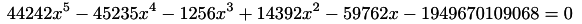
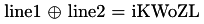
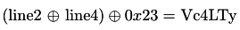
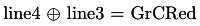

## ASIS Finals: license

----------
## Challenge details
| Contest        | Challenge     | Category  | Points |
|:---------------|:--------------|:----------|-------:|
| ASIS Finals | License | Reversing | 125  |


*Description*
> Find the flag in this file.

----------
## Write-up

### Format of Keyfile

We are given a binary file:

>```
>$ file license 
>license: ELF 64-bit LSB  executable, x86-64, version 1 (SYSV), dynamically linked (uses shared libs), for GNU/Linux 2.6.24, BuildID[sha1]=c81d4aad867bcf65380fef33fcab2ee2372c03a9, stripped
>```

On a first run:

>```
>$ ./license 
>key file not found!
>```

Lets look at the disassembly in IDA, we find the filename it is looking for in the first three lines of *main*

>```asm
>mov     esi, offset modes ; "rb"
>mov     edi, offset filename ; "_a\nb\tc_"
>```

Since there are no other xrefs to the filename, I chose to patch the filename in the binary to something friendlier:

>```
>$ python -c 'import binascii; print binascii.hexlify("keyABCD")'
>6b657941424344
>```


Continuing to follow the execution flow of the program when it can find the keyfile we get to the following pseudocode:

>```C
>fclose(v4);
>if ( -45235 * length_of_keyfile * length_of_keyfile * length_of_keyfile * length_of_keyfile
>	+ -1256 * length_of_keyfile * length_of_keyfile * length_of_keyfile
>	+ 14392 * length_of_keyfile * length_of_keyfile
>	+ -59762 * length_of_keyfile
>	- 1949670109068LL
>	+ 44242 * length_of_keyfile * length_of_keyfile * length_of_keyfile * length_of_keyfile * length_of_keyfile )
>{
>LOBYTE(v5) = 0;
>LODWORD(v18) = std::operator<<<std::char_traits<char>>(6299840LL, 4198643LL);// invalid format
>std::endl<char,std::char_traits<char>>(v18);
>}
>else
>{....
>```

Which means our keylength needs to be a solution to the following inequality:



For which wolframalpha gives us the solution: 34


The next part, with the variables renamed:

>```C
>else
>{
>  v34 = base_of_input;
>  pos_in_file = base_of_input;
>  newline_counter = 1;
>  while ( length_of_keyfile > pos_in_file - base_of_input )
>  {
>	v13 = pos_in_file + 1;
>	if ( *(_BYTE *)pos_in_file == '\n' )
>	{
>	  v14 = newline_counter++;
>	  *(&v34 + v14) = v13;
>	}
>	pos_in_file = v13;
> }
>  length_of_line = (length_of_keyfile - (newline_counter - 1)) / newline_counter;
>  dword_6021E0 = length_of_line;
>  if ( (unsigned __int64)(5 * (signed int)length_of_line) > 91 || (signed int)length_of_line <= 0 )
>  {
>	v5 = 32;
>	LODWORD(v17) = std::operator<<<std::char_traits<char>>(6299840LL, 4198643LL);// invalid format
>	std::endl<char,std::char_traits<char>>(v17);
>  }
>  else if ( newline_counter == 5 )
>  {
>```

So to move on we need our keyfile to contain four newline characters, which means the length of each line is six (30 / 5), the last line must not end with a newline.

By now we know our keyfile is of the following form:

>```
>aaaaaa
>bbbbbb
>cccccc
>dddddd
>eeeeee
>```


### The Key

The next part of the binary will establish a relation between the five lines of the keyfile, there are 5 checks:

#### 1

>```C
>	do
>	{
>	  s1[index1] = *(line_1 + index1) ^ *(line_2 + index1);
>	  ++index1;
>	}
>	while ( length_of_line > index1 );
>	if ( memcmp(
>		   s1,
>		   "iKWoZLVc4LTyGrCRedPhfEnihgyGxWrCGjvi37pnPGh2f1DJKEcQZMDlVvZpEHHzUfd4VvlMzRDINqBk;1srRfRvvUW",
>		   length_of_line) )
>	  goto fail;
>```

Giving the first relation:



#### 2

>```C
>	do
>	{
>	  s1[index2] = *(line_2 + index2) ^ *(line_4 + index2) ^ 0x23;
>	  ++index2;
>	}
>	while ( length_of_line > index2 );
>	line_4_again = line_4;
>	if ( memcmp(s1, &aIkwozlvc4ltygr[length_of_line], length_of_line) )
>	  goto fail;
>```

Giving the second relation:



#### 3

>```C
>	do
>	{
>	  s1[index3] = *(line_4_again + index3) ^ *(line_3 + index3);
>	  ++index3;
>	}
>	while ( length_of_line > index3 );
>	if ( memcmp(s1, (2 * length_of_line + 0x401120LL), length_of_line) )
>	  goto fail;
>```

Giving the third relation:



#### 4 & 5

>```C
>	do
>	{
>	  s1[index4] = *(line_4_again + index4) ^ *(line_5 + index4) ^ 0x23;
>	  ++index4;
>	}
>	while ( length_of_line > index4 );
>	v28 = 0LL;
>	do
>	{
>	  s1[v28] ^= *(line_3 + v28);
>	  ++v28;
>	}
>	while ( length_of_line > v28 );
>	if ( !memcmp(s1, (3 * length_of_line + 0x401120LL), length_of_line)
>	  && (v5 = memcmp(line_4_again, (4 * length_of_line + 0x401120LL), length_of_line)) == 0 )
>	{
>	  v29 = 0LL;
>	  do ...
>```

Giving the fourth and final relations:


Since we know the fourth line, we can deduce the other lines from that, as the following python code implements:

>```python
>#!/usr/bin/python
>
>from pwn import *
>
>answer = "iKWoZLVc4LTyGrCRedPhfEnihgyGxWrCGjvi37pnPGh2f1DJKEcQZMDlVvZpEHHzU"
>
>a4 = answer[24:30]
>a2 = xor(xor(a4, chr(0x23)*6), answer[6:12])
>a1 = xor(answer[0:6], a2)
>a3 = xor(answer[12:18], a4)
>a5 = xor(xor(xor(answer[18:24], a3), a4), chr(0x23)*6)
>
>with open("keyABCD", "w") as f:
>    f.writelines((a1 + "\n", a2 + "\n", a3 + "\n", a4 + "\n", a5))
>```

After which the flag is revealed:

>```
>$ ./license 
>program successfully registered to ASIS{8d2cc30143831881f94cb05dcf0b83e0}
>```

