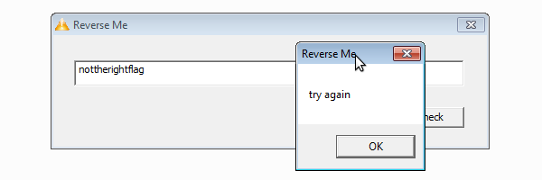

# Whitehat Contest: Re300

----------
## Challenge details
| Contest        | Challenge     | Category  | Points |
|:---------------|:--------------|:----------|-------:|
| whitehat | Re300 | Reversing |    300 |

>*Flag = WhiteHat{SHA1(key)}*
>
>*The key is a string that has meaning*
----------

## Write-up
### Reversing

Open the binary in IDA, I used IDAStealth to get IDA's Local Win32 debugger to work (check the Fake parent process box).

Lets first try some flag:



Well it didn't work, but we can see that there probaly is some MessageBoxA involved here, lets break on that. We can find MessageBoxA in the import window. Put a breakpoint on it and rerun the program. 

We break at:

>```asm
>.text:00067DE1                 call    ds:MessageBoxA
>```

look at the previous function in the callstack:

>```
>00061993 ?_Get_deleter@_Ref_count_base@std@@UBEPAXABVtype_info@@@Z+0x523
>```

Looking around in that function we see calls to GetWindowTextLengthA and GetWindowText, so this looks like a good place to start.

First the length of our input is checked, it must be greater than 50:

>```asm
>.text:00061981                 cmp     eax, 32h
>.text:00061984                 jg      short loc_619D2
>```

Then the length is checked again, this time it must be smaller than 100:
>```asm
>.text:000619D2                 cmp     eax, 64h
>.text:000619D5                 jge     short loc_61986
>```

There is some more copying to get our input in memory and then we reach the first check:

>```asm
>.text:00061A2B                 call    checknumberouno
>.text:00061A30                 test    eax, eax        ; want eax to be nonzero
>.text:00061A32                 jnz     short loc_61A63
>```

checknumberouno looks like this:

>```asm
>.text:00061123                 mov     edi, [eax+4]    ; CODE XREF: checknumberouno+B4j
>.text:00061126                 add     edi, [eax]
>.text:00061128                 cmp     edi, [edx+eax]
>.text:0006112B                 jnz     short loc_6114D
>.text:0006112D                 inc     ecx
>.text:0006112E                 add     eax, 4
>.text:00061131                 cmp     ecx, 13h
>.text:00061134                 jl      short 61123h
>```
It takes our first and second characters and adds them (first two lines), then compares it to some value in [edx+eax] and fails if they dont match, otherwise it continues with the next character. Looking on the stack we find the 13h values of [edx+eax]

>```
>Stack[00000F90]:0352F324                 dd 223, 210, 222, 167, 155, 156, 168, 166, 98, 97, 102
>Stack[00000F90]:0352F324                 dd 86, 85, 161, 161, 174, 228, 216, 213
>```
A bit further we find:

>```asm
>.text:00061A69                 call    checknombredeux
>.text:00061A6E                 test    eax, eax
>```
Which works exactly the same as the first check, except the values are different:

>```
>Stack[00000550]:0338FA1C                 dd 147, 158, 226, 167, 166, 231, 179, 180, 227, 234, 175
>Stack[00000550]:0338FA1C                 dd 102, 175, 219, 201, 224, 169, 175, 175, 65
>```
Then there is a IsDebuggerPresent check, which IDAStealth can bypass for us, and then the final check:

>```asm
>.text:00061A83                 call    checknumerusdrei
>.text:00061A88                 push    0               ; unsigned int
>.text:00061A8A                 push    0               ; lpCaption
>.text:00061A8C                 test    eax, eax
>```

The final values we need are:
>```
>Stack[00000FE0]:034EF8D0                 dd 219, 146, 167, 164, 147, 151, 164, 228, 233, 231, 165
>Stack[00000FE0]:034EF8D0                 dd 167, 220, 155, 153, 226, 219, 147, 155, 6
>```
Time to get out of all this assembly and code some python:

>```python
>#!/usr/bin/python
>import string
>
>
>def addLetter(solution, number):
>    lastletter = solution[-1:]
>    answer = chr(number - ord(lastletter))
>    return answer
>
>answers1 = [223, 210, 222, 167, 155, 156, 168, 166, 98, 97, 102, 86, 85, 161, 161, 174, 228, 216, 213]
>
>for letter in string.printable:
>	part1 = letter
>	for number in answers1:
>		try:
>			part1 += addLetter(part1, number)
>		except ValueError:
>			continue
>	print part1
>
>print "***************************************************************************************"
>
>answers2 = [147, 158, 226, 167, 166, 231, 179, 180, 227, 234, 175, 102, 175, 219, 201, 224, 169, 175,175, 65]
>
>for letter in string.printable:
>	part2 = letter
>	for number in answers2:
>		try:
>			part2 += addLetter(part2, number)
>		except ValueError:
>			continue
>	print part2
>
>print "***************************************************************************************"
>
>answers3 = [219, 146, 167, 164, 147, 151, 164, 228, 233, 231, 165, 167, 220, 155, 153, 226, 219, 147, 155, 66]
>
>for letter in string.printable:
>	part3 = letter
>	for number in answers3:
>		try:
>			part3 += addLetter(part3, number)
>		except ValueError:
>			continue
>	print part3
>```

We remember the hint *The key is a string that has meaning*, and concatenate three parts which seem to have meaning and we find the flag:

>```
>whjt3h4t2015!4m4zjngc0nt3st?un|33|_jv3|3|_3t0c4ptur3th3f|_4g
>```


