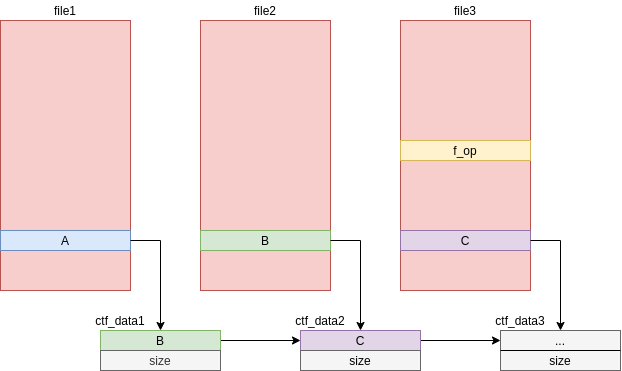

# Challenge description

```
Fullchain

Do you have what it takes to pwn all the layers?
```

* Category: Pwn
* Points: 326
* Solves: 15

## Introduction

Last weekend it was GoogleCTF weekend again :). I didn't have much time to
spend on it this year; but I took a quick look at `Fullchain`. This challenge
comes with two patches for chrome and a linux kernel module (with source).
Together these introduce three vulnerabilities.

1. An out of bounds write in a TypedArray
2. Mojo out of bounds/read write
3. Linux kernel UAF

Reaching the flag required a full chain of three exploits.

## Exploiting the renderer to activate Mojo bindings

The bug is introduced in `v8_bug.patch`:

In `TypedArrayPrototypeSetTypedArray` an important bounds check is removed:

```
CheckIntegerIndexAdditionOverflow(srcLength, targetOffset, targetLength)
    otherwise IfOffsetOutOfBounds;
// CheckIntegerIndexAdditionOverflow(srcLength, targetOffset, targetLength)
//     otherwise IfOffsetOutOfBounds;
```

This removes the bounds check when calling `set` on a TypedArray. The following
will then crash a debug build of `d8`:

```
d8> var a = new Uint8Array([0,0])
d8> a.set(a, 1)
abort: CSA_ASSERT failed: Torque assert 'countBytes <= target.byte_length -
startOffset' failed [src/builtins/typed-array-set.tq:270]
[../../src/builtins/typed-array-set.tq:92]
```

Since we can write out of bounds of the data buffer we immediately become
interested to discover what lies right after the data buffer of a TypedArray:

```
var a = new Uint8Array(new Array(4).fill(0xab));
%DebugPrint(a);

// Lots of output, but the important part is:
- map: 0x24fb082c24d9 <Map(UINT8ELEMENTS)> [FastProperties]
- data_ptr: 0x24fb08109c34

gef➤  x/xg 0x24fb08109c34
0x24fb08109c34:	0x082c24d9abababab
```

We see that right after the data buffer is the [compressed](https://blog.infosectcbr.com.au/2020/02/pointer-compression-in-v8.html)
`map` pointer. Among other things, this `map` holds information about the
datatype of the array.  Let's see what happens if we were to change this to
another type.  (In a non-debug build of `d8` otherwise we will trigger debug
assertions)

```
var b = new Uint32Array(new Array(4).fill(0xdeadbeef));
%DebugPrint(b)
 - map: 0x24fb082c3181 <Map(UINT32ELEMENTS)> [FastProperties]

var c = new Uint8Array([0x81, 0x31]);  // Lower two bytes of b's map
a.set(c, 4)                            // Overwrite a's map

d8> a
2880154539,136327553,134226477,134518561
```

Now `a` is still the same length, but all the elements are 32 bit. Thus the
data buffer is now assumed to be 16 bytes. This allows an OOB read/write on
three 32 bit values after `a`.

An interesting memory layout happens if we allocate an ArrayBuffer right after
an TypedArray:

```
var a = new Array(64).fill(0xab);
var b = new Uint8Array(a)
var c = new Arraybuffer(4);

%DebugPrint(b)
 - data_ptr: 0x31ef08109958

%DebugPrint(c);
DebugPrint: 0x31ef081099e1: [JSArrayBuffer]
 - backing_store: 0x55555563c410

// The distance between the data buffer and the JSArrayBuffer
gef➤  p/x 0x31ef081099e1 - 0x31ef08109958
$2 = 0x89
gef➤  p 'v8::internal::TorqueGeneratedJSArrayBuffer<v8::internal::JSArrayBuffer, v8::internal::JSObject>::kBackingStoreOffset'
$3 = 0x1c
gef➤  p/d (0x88+0x1c)/4
$4 = 41
```

Thus we can modify the backing store of the ArrayBuffer by writing to fields
41 and 42 of the corrupted TypedArray.

However, so far we only encountered compressed pointers but the top bits of this
pointer are also in the memory right after the corrupted TypedArray:

```
gef➤  x/xw 0x31ef08109958 + 27*4
0x31ef081099c4:	0x000031ef
```

And in a real chrome process (this is where we leave the `d8` shell) we can then
find a chrome pointer at `0x000031ef00000040` to break ASLR

Following along with [Project
Zero](https://googleprojectzero.blogspot.com/2019/04/virtually-unlimited-memory-escaping.html)
it is now possible to enable the Mojo bindings and reload the page.

Follow the same offsets as the blog from the `g_frame_map`, the magic offset to
`RenderFrameImpl::enabled_bindings_` can be found by disassembling the function
which checks if Mojo bindings should be enabled:

```
gef➤  disassemble 'content::RenderFrameImpl::DidCreateScriptContext(v8::Local<v8::Context>, int)'
0x000056049f6e2369 <+89>:	test   BYTE PTR [rbx+0x444],0x2
```

All that's left for this stage is to write the `BINDINGS_POLICY_WEB_UI` bit to
the address we found and reload the page. We then have the `Mojo` object in our
javascript context, which we need for the next stage.

## Code execution outside of the sandbox
The bug is introduced in `sbx_bug.patch`, which adds a `CtfInterface` with
three functions:

```cpp
void CtfInterfaceImpl::ResizeVector(uint32_t size,
                                    ResizeVectorCallback callback) {
  numbers_.resize(size);
  std::move(callback).Run();
}

void CtfInterfaceImpl::Read(uint32_t offset, ReadCallback callback) {
  std::move(callback).Run(numbers_[offset]);
}

void CtfInterfaceImpl::Write(double value,
                             uint32_t offset,
                             WriteCallback callback) {
  numbers_[offset] = value;
  std::move(callback).Run();
}
```

There are no bounds check on anything here. Again we can read/write out of
bounds, this time to everything after the `numbers_` vector.

This `CtfInterface` consists of three pointers:

1. vtable (Note: the 12 bottom bits are fixed)
2. vector data\_start
3. vector data\_end

If we were to allocate a `CtfInterface` with a vector of size 4, we get in
memory:

1. `0x...4e0`
2. `v`
3. `v + 0x20`

A possible way gain code execution is thus to allocate a `CtfInterface` and scan
some memory following the vector for this pattern. This immediately gives us
the address of our vector (breaking heap ASLR) and a vtable pointer (breaking
chrome ASLR and allowing RIP control).

Ofcourse the vector may not always be located in memory before the
`CtfInterface`, but we can just keep allocating `CtfInterfaces` in a loop until
we have the desired layout.

To pop the shell I then fake a `CtfInterface` vtable (of which I modify the
`resizeVector` function pointer). And then write a small ropchain to `execve`
`/bin/sh`. Since `rax` points at the vtable the `xchg rsp, rax` gadget is
useful to pivot the stack.

I had some issues with my ropchain getting overwritten so in my exploit you'll
see that I first scan for some unused (zeroed) memory to write the
vtable+ropchain at.

Now that we have a shell as a normal user we only need to get root.

## The home stretch: Getting root

We get the source to a kernel module which is inserted into the running kernel.

The module adds a device: `/dev/ctf` with which we can interact from
userspace to:

* open

Allocates a zero initialized `ctf_data` struct and saves it in the files struct
`private_data`

* read/write

Read/Write an user specified amount of bytes from `ctf_data->mem` to
user/kernel space

* ioctl

Allocate/free a buffer of user controlled size in kernel space. Saves the
allocated buffer in `ctf_data->mem`

* close

Free the `ctf_data->mem` buffer

However on freeing `ctf_data->mem` the pointer is not zeroed out. Allowing a
UAF on this allocation.

If we allocate and free a buffer of size `0x10`, we can reallocate this memory
with another `ctf_data` struct. We can use this to create the following memory
layout (which is kind of hard to describe in words so I drew a picture):



I've drawn the `file` structs as red boxes and put a letter representing a
pointer in each `private_data`.

Now two things are interesting:

1. Reading from fd1 we get a pointer. (`C`) Because of the reallocation trick
   this is the same pointer as is stored in fd3's `private_data`
2. By writing to fd1 we can control fd2's `ctf_data`. This gives us arbitrary
   read/write in the kernel.

Because we have a leaked heap pointer and arbitrary read/write we can scan
memory for fd3's `private_data`, since this should be at offset `0xc8` from the
`file` struct we can filter on this to eliminate most false positives.
Sometimes this still hits a false positive but it's a CTF so it's good enough
(and it wouldn't be hard to perform more validation or abort)

After locating fd3's `file` struct we can break ASLR by reading a kernel
pointer from this struct. We gain RIP control by overwriting the `f_ops`. I
overwrite the `ctf_write` function with `set_memory_x`, then:

```c
write(fd3, (char *)1, 1);
```
Becomes:
```c
ctf_write(struct file *f, const char __user *data, size_t size, loff_t *off)
```
Which becomes (because of the function pointer hijack)
```c
set_memory_x(f, 1)
```
Which means we now have an RWX page in the kernel at fd3's `file` to drop our
shellcode. We can then obtain root with the classic
`commit_creds(prepare_kernel_creds(NULL))` shellcode.

Use the arbitrary read/write to cleanly restore fd3's `file` and then `execve`
into `/bin/sh`, finish with `cat /dev/vdb` for the flag!

Note that the target did not have network connectivity, so I dropped my kernel
exploit the low-tech way by pasting it into the shell as base64 :)

See also the exploits:
* [Chrome](exploit.html)
* [Linux](exploit.c)

```
CTF{next_stop_p2o_fda81a139a70c6d4}
```
